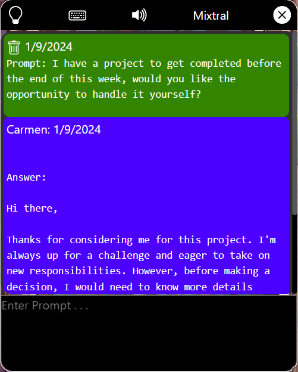
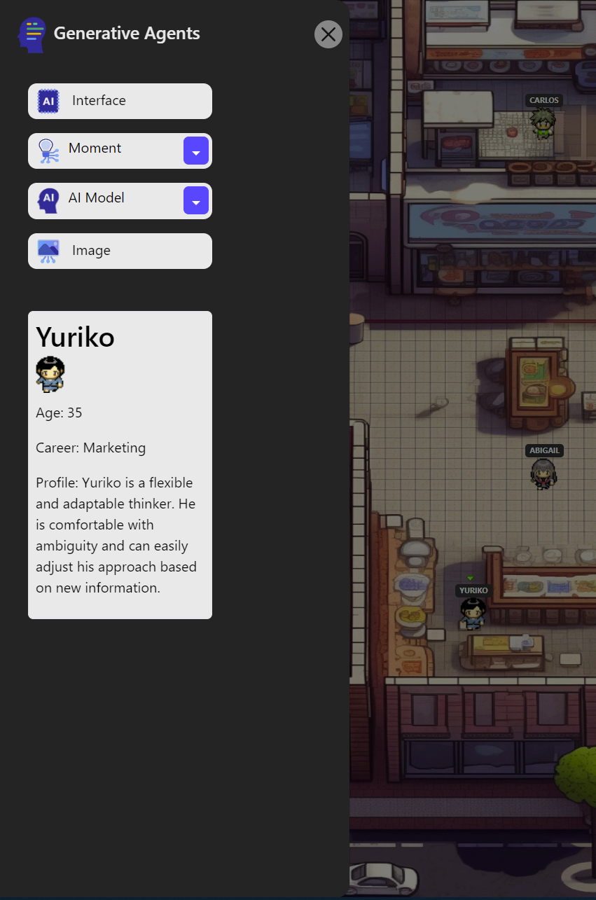

# Generative Agent Momentum Experientia (G.A.M.E.)

<div style="width: 55em; display: block; margin: 0 auto;">
  
</div>

A Portland State University (PSU) Undergrad Capstone Project for Computer Science.

This application is inspired by the Generative Agents program created by [Joon Sung Park PH.D. Student in Computer Science at Stanford](https://profiles.stanford.edu/joon-sung-park). His [Generative Agents: Interactive Simulacra of Human Behavior](https://arxiv.org/abs/2304.03442) expresses the idea that "believable proxies of human behavior can empower interactive applications ranging from immersive environments to rehearsal spaces for interpersonal communication to prototyping tools". The original project can be viewed on [GitHub: Generative Agents](https://github.com/joonspk-research/generative_agents).

## Premise

Create a limited version of the Generative Agent interactive experience using free open source ai models through [Huggingface](https://huggingface.co/).

## Differentiation

OG GenAgents - Difficult to set up and enjoy the experience
Ours - Yes, we require you understand how to watch a youtube video and set up the Firebase DB. We also require that you have your own Huggingface API Token. Other than that, installation is done from the command line using (wait for it): $ yarn

OG GenAgents - Requires a paid subscription to use with ChatGPT, and this is also limiting
Ours - Intended to be used with a free AI Model from Huggingface allowing any model you want to add that we do not have listed. Endless options and outcomes

OG GenAgents - You most likely only experience a play back of some long days experience and only realize later if modifications have worked (or, not).
Ours - Prompts and interactive experiences are live.

OG GenAgents - Original code is custom fit for a specific purpose and not readily accessible for modification or addition
Ours - Intended to allow React freaks to freak out and build some seriously cool sh.t

Don't 'git' me wrong. We love the original idea and Joon has laid the foundation for the various implementations I have already seen in the great wild of GitHub. We just want to have fun and let you enjoy some of the experiences that he outlined in a live mode where you get to participate in a meaningful way. This project attempts to further his directive to build those 'believable proxies of human behavior' while having fun.

## G.A.M.E. Momentum

To achieve a live experience with agent interaction we have limited the program to `moments`. A `moment` is like the original Generative Agent `whisper` where an agent is given an idea to play out. When a `moment` is chosen by a user, a specified agent will initiate the `moment`. From there, each agent is given this `moment` and based on their persona, they will give feedback, advice, or help in some creative way to make that `moment` happen.

Several `moments` will be created for the user to choose from which should inspire the user to create their own `moment` to try out.

Further, a message interface allows you to develop your skills in a one-on-one with a chosen agent and its persona. Write a few lines and see how it will resond, or try an entire `moment` and see if you can achieve a specific goal.

## User Interaction | Message Interface

The `interface` allows you to test out various methods of prompting. When selecting an agent in the game, you take control of that character. When you open the `interface`, any input (prompt) that you create will have a response based on the persona of the character you have selected. In the sidebar you will see the profile of the agent, including their name, age, career, and personality.

The `lightbulb` icon will switch the view to `moments`, allowing an easy method of viewing the entire conversation created for each `moment` that you have selected.

<div style="padding-top: 1em; width: 10em; margin: 0 auto">
  
</div>

## Sidebar

- Open / Close the message `interface`
- Select and begin a `moment`
- Change the Huggingface AI Model: ["Mistral Instruct", "Mixtral", "Zephyr"]
- View the currently selected agent profile

<div style="width: 10em; margin: 0 auto;">
  
</div>

## Program Requirements | Environment Variables

This application requires the following accounts be created to run the program, but each of these offer a free version which the application used during testing and build:

- [Huggingface](https://huggingface.co/)
- [Firebase](https://firebase.google.com/)
- [EmailJS: Optional](https://www.emailjs.com/)

You will need to add a `.env` file to the /root of this repository and create the following environment variables which you will have after creating your accounts listed above:

```js
VITE_HUGGINGFACE_API_TOKEN = "";
VITE_FIREBASE_API_KEY = "";
VITE_FIREBASE_AUTH_DOMAIN = "";
VITE_FIREBASE_DB_URL = "";
VITE_FIREBASE_PROJECT_ID = "";
VITE_FIREBASE_STORAGE_BUCKET = "";
VITE_FIREBASE_MESSAGING_SENDER_ID = "";
VITE_FIREBASE_APP_ID = "";
VITE_EMAILJS_API_KEY = "";
VITE_EMAILJS_SERVICE_ID = "";
VITE_EMAILJS_TEMPLATE_ID = "";
```

## Download & Install Dependencies

You can fork the project, download a zip file, or use a bash command line to copy this GitHub repository.

Using `Node v20` and the `yarn` package manager.

```bash
# Install the package.json dependencies
yarn
```

```bash
# run the program
yarn dev
```

## Why A ReactJS Framework and Not Python?

The original code base is in Python and most of the programs dealing with AI Models also use Python. I imagine this is due to the large number of available libraries that help fine tune the models and interact with the api's. We are not trying to fine tune ai models and have found simple methods of prompting the models to achieve our goal.

As undergrad computer scientists, we wanted to give like minded people the ability to get creative. Building this application in `React` will expand the ai model community beyond Python developers to include another arena of brilliant devs that may want to tear this repo apart and make something truly unique.

## Resource Citations

1. Game background image created by Steven Ochs: [Steven Ochs "Imagination Sculpts Reality"](https://goosecubeproject.com/)

2. Main logo and sidebar icons sourced from: [VectorStock: Generative AI Vector Set](https://www.vectorstock.com/royalty-free-vector/generative-ai-artificial-intelligence-icon-set-vector-47405050)

3. Agent sprite characters sourced from the original Generative Agents GitHub repo: [GitHub: Generative Agents](https://github.com/joonspk-research/generative_agents) which I believe are the creation of [PixyMoon: Twitter(X)](https://twitter.com/_PixyMoon_) please let me know if this is incorrect.
