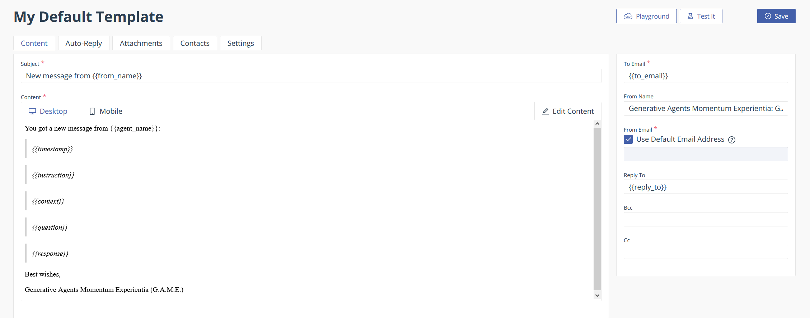

# EmailJS | Free Version

This optional component uses the [Emailjs](https://dashboard.emailjs.com/admin/templates/gfwd2g6) library. You will need to create your own account with EmailJS to use the application.

EmailJS free version allows 200 emails per month (as of Jan 1 2024).

The `yarn` package manager will install the required dependency for EmailJS.

## EmailJS Environment Variables

If you have not already created the `.env` file in /root, create it now and add the following variables as shown. Replace the strings with your respective values given from EmailJS.

1. Select Email Services > Gmail > Give the new service a name > copy the Service ID (add this to the VITE_EMAILJS_SERVICE_ID in the .env) > Press the 'Connect Account' and select the 'Send email on your behalf > Select Continue > Finally, select Create Service > Check your email to verify the connection as a 403 server error may occur but the connection was successful.
2. Create USER Key > Go to 'Account' tab > Copy the Public Key for the VITE_EMAILJS_USER_ID > Add it to .env file
3. Create a new Template > Once the template is saved, copy the TEMPLATE ID > add the TEMPLATE ID to the .env file


```json
VITE_EMAILJS_USER_ID="yourKeyFromEmailJS"
VITE_EMAILJS_SERVICE_ID="yourIdFromEmailJS"
VITE_EMAILJS_TEMPLATE_ID="theTemplateId"

```

## EmailJS Template SetUp

The template id used in the variables above will be given once you create a template. This application expects that you create a template as shown in the image below. Each of the {{variabl_names}} are specific to what will be sent from the email form. CTRL+SHFT+V will open this markdown in a visual screen showing the image linked below.

You will need to create an account with EmailJS. This component uses Gmail as the Email Service.

The Email Template uses has the following variables:


